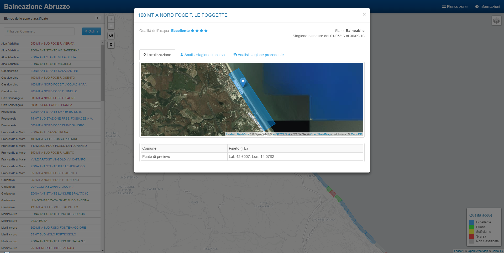

# balneazione
Una applicazione di web mapping che mostra i dati sulla balneabilità della costa abruzzese. Si basa sui servizi del Portale Acque del Ministero della Salute.

Questa applicazione web &egrave; stata sviluppata sfruttando i servizi ReST esposti dal <a href='http://www.portaleacque.salute.gov.it' target='_blank'>Portale Acque</a> del <a href='http://salute.gov.it' target='_blank'>Ministero della Salute</a>. I dati sono rilasciati sotto licenza Creative Commons <a href='http://creativecommons.org/licenses/by-nc-nd/4.0/deed.it' target='_blank'>Attribuzione-Non commerciale-Non opere derivate 4.0 Unported</a>. La classificazione delle zone si basa su quella riportata nell’Allegato A alla <a href='http://www.artaabruzzo.it/download/aree/acqua/balneazione/20160414_AL_balneazione_all_08a_2016_dgr_148_2016.pdf' target='_blank'>D.G.R. n. 148 del 10/3/2016</a>.

<a href="http://www.alessiodilorenzo.it/balneazione/">Lancia l'applicazione</a>
