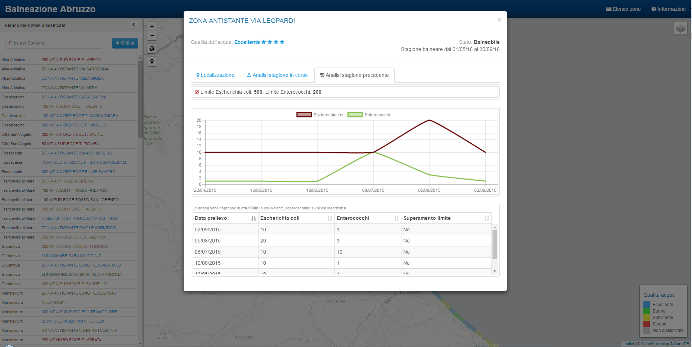

# balneazione
Una applicazione di web mapping che mostra i dati sulla balneabilità della costa abruzzese. Si basa sui servizi del Portale Acque del Ministero della Salute.

<a href="http://www.alessiodilorenzo.it/balneazione/">Lancia l'applicazione</a>
